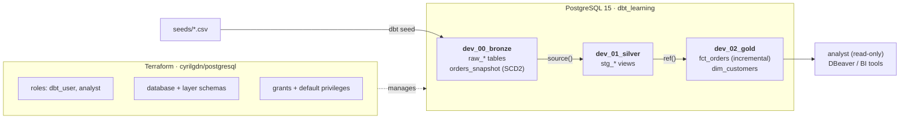

# dbt-terraform-postgres-medallion

[](https://github.com/matiastulli/dbt-terraform-postgres-medallion/actions/workflows/ci.yml)


A local data platform. **dbt** transforms data through **bronze → silver → gold** layers in **PostgreSQL**, and **Terraform** manages the database, roles, schemas and grants as code. Everything runs on a laptop with no cloud account, and CI rebuilds it from scratch on every push.

It uses dbt Labs' [Jaffle Shop](https://github.com/dbt-labs/jaffle_shop) sample data (customers, orders, payments), extended with simulated late-arriving data.

## Architecture



| Layer | dbt folder | Postgres schema | Contents |
|---|---|---|---|
| Bronze | `seeds/`, `models/00_bronze/`, `snapshots/` | `dev_00_bronze` | Raw CSVs, source definitions, order-status history |
| Silver | `models/01_silver/` | `dev_01_silver` | `stg_*` views: renamed, typed, one per source |
| Gold | `models/02_gold/` | `dev_02_gold` | `fct_orders` (incremental), `dim_customers` |

## What this project shows

**dbt**
- **Medallion layering:** schemas are set per folder, sources are declared in YAML, and `ref()` builds the dependency graph.
- **Incremental model:** `fct_orders` uses `merge` on `order_id` with a lookback window, plus a reconciliation test that catches drift when late data falls outside the window.
- **Snapshot (SCD type 2):** order status history with the `check` strategy, since the raw data has no `updated_at`.
- **Tests:** generic tests (`unique`, `not_null`, `relationships`, `accepted_values`), `dbt_utils` tests, and a custom SQL test that reconciles gold revenue with silver.
- **Docs:** every model and column is described, with reusable doc blocks. `persist_docs` writes the descriptions to Postgres as comments, so they show in DBeaver and BI tools.
- **Macros and variables:** `cents_to_dollars()`, and payment-method columns generated by a Jinja loop from a single `var()` that also drives a test.

**Terraform**
- **Existing objects adopted** with `import` blocks, and schemas renamed in place with `moved` blocks.
- **A least-privilege analyst role:** `SELECT` grants plus **default privileges**, so tables dbt rebuilds stay readable.
- **One `for_each` over the layer schemas:** adding a layer adds its schema and grants together.

**CI** ([.github/workflows/ci.yml](.github/workflows/ci.yml))
- Every push starts a fresh Postgres, runs `terraform fmt/validate/apply`, then `dbt seed`, `build` and `docs generate`, and uploads the docs site as a downloadable artifact.

## Project structure

```
├── models/
│   ├── 00_bronze/        _sources.yml
│   ├── 01_silver/        stg_*.sql + tests/docs YAML
│   ├── 02_gold/          fct_orders.sql, dim_customers.sql + tests/docs YAML
│   └── _docs.md          reusable doc blocks
├── seeds/                raw CSVs
├── snapshots/            orders_snapshot.yml
├── macros/               cents_to_dollars.sql
├── tests/                singular SQL tests
├── terraform/            roles, database, schemas, grants
├── .github/workflows/    CI
├── dbt_project.yml · packages.yml · profiles.yml
└── requirements.txt · .env.example
```

---

## Setup from scratch

Requirements: PostgreSQL 15 (e.g. Homebrew), Python 3.11, Terraform ≥ 1.5.

```sh
# 1. Postgres running
brew services start postgresql@15

# 2. Python env + dbt
python3 -m venv .venv
source .venv/bin/activate
pip install -r requirements.txt

# 3. Secrets: copy the template and set passwords (.env is gitignored)
cp .env.example .env
source .env

# 4. Infrastructure: database, roles, schemas, grants
terraform -chdir=terraform init
terraform -chdir=terraform plan -out=tfplan
terraform -chdir=terraform apply tfplan

# 5. dbt: packages, raw data, everything else
dbt deps
dbt seed
dbt build
```

## Every new terminal

```sh
source .venv/bin/activate && source .env   # run from the repo root
```

`.env` sets `DBT_PROFILES_DIR`, so dbt uses the `profiles.yml` in this repo, not `~/.dbt/`.

---

## dbt commands

### Build and run

| Command | What it does |
|---|---|
| `dbt build` | Everything in DAG order: seeds, models, snapshots, tests. A failing test **skips** everything downstream |
| `dbt run` | Models only, no tests |
| `dbt test` | Tests only, no rebuilding |
| `dbt seed` | Load `seeds/*.csv` into `dev_00_bronze` |
| `dbt snapshot` | Record changes in `orders_snapshot` |
| `dbt build --select fct_orders+ --full-refresh` | Rebuild an incremental model from scratch |
| `dbt build --fail-fast` | Stop at the first failure |
| `dbt retry` | Re-run only what failed or was skipped in the previous command |

### Selecting what to run (`--select` / `--exclude`)

These work with `build`, `run`, `test`, `ls`, `compile` and `show`.

| Selector | Selects |
|---|---|
| `stg_orders` | One model |
| `+fct_orders` | The model and everything **upstream** |
| `stg_orders+` | The model and everything **downstream** |
| `1+dim_customers` | The model plus one level upstream |
| `@stg_orders` | Downstream, plus everything those need upstream |
| `01_silver` / `path:models/02_gold` | A whole folder or layer |
| `source:jaffle_shop+` | Everything built on a source |
| `config.materialized:incremental` | By config |
| `resource_type:snapshot` | By type (`model`, `test`, `seed`, `snapshot`...) |
| `test_type:singular` | Only SQL tests in `tests/` |
| `stg_orders,resource_type:test` | **Intersection** (comma): tests on `stg_orders` |
| `--exclude resource_type:test` | Leave something out |

Check a selection before running it: `dbt ls --select stg_orders+`

### Develop and debug (no copy-pasting Jinja into a SQL editor)

| Command | What it does |
|---|---|
| `dbt show --select dim_customers --limit 10` | Preview a model's result **without building** it |
| `dbt show --inline "select * from {{ ref('fct_orders') }} where amount > 50"` | Run ad-hoc SQL **with Jinja** (`ref`, `source`, macros, `var`) |
| `dbt compile --select fct_orders` | Write plain SQL to `target/compiled/...`, ready to paste into a SQL editor |
| `dbt compile --inline "{{ cents_to_dollars('amount') }}"` | See what a macro or loop turns into |
| `dbt ls --select +dim_customers` | List lineage in the terminal |
| `dbt ls --resource-type model --output json` | Machine-readable project listing |
| `dbt parse` | Validate the project without touching the database |
| `dbt debug` | Check profile, project and connection |

After a test fails, the error prints the path of the compiled test SQL. Run that file to see the failing rows.

> ⚠️ **`--empty`** (for example `dbt build --empty`) builds every selected model with **zero rows**. It's a fast "does all the SQL run?" check, but it **replaces your real views and tables with empty ones**. Only use it on a separate target, or run a normal `dbt build` right after.

### Tests

| Command | What it does |
|---|---|
| `dbt test --select stg_orders` | Tests on one model |
| `dbt test --select test_type:singular` | Only custom SQL tests |
| `dbt test --store-failures` | Save failing rows to a table in the database |

### Docs

```sh
dbt docs generate      # writes target/index.html, manifest.json, catalog.json
dbt docs serve         # http://localhost:8080 (lineage: blue button, bottom right)
dbt docs serve --port 8081
```

Descriptions are also written to Postgres as comments (`+persist_docs`). CI uploads the generated site as the `dbt-docs` artifact.

### Variables, macros, packages

| Command | What it does |
|---|---|
| `dbt build --vars '{payment_methods: [credit_card, coupon]}'` | Override a `var()` for one run |
| `dbt run-operation <macro_name> --args '{arg: value}'` | Run a macro on its own (admin tasks) |
| `dbt deps` | Install `packages.yml` into `dbt_packages/` and write `package-lock.yml` |
| `dbt deps --upgrade` | Upgrade packages within their version ranges |

### Environments and CI (for later, needs a `prod` target)

| Command | What it does |
|---|---|
| `dbt build --target prod` | Build into another environment from `profiles.yml` |
| `dbt build --select state:modified+ --state <prod-artifacts-dir>` | "Slim CI": only changed models and their downstream |
| `dbt build --select state:modified+ --defer --state <dir>` | Same, but unchanged upstream models are read from prod |
| `dbt clone --state <dir>` | Copy prod relations into dev instead of rebuilding them |
| `dbt source freshness` | Check how recent the raw data is (needs `freshness` config on sources) |

### Housekeeping

| Command | What it does |
|---|---|
| `dbt clean` | Delete `target/` and `dbt_packages/` (run `dbt deps` afterwards) |

---

## Terraform commands

Always from the repo root, after `source .env`. `-chdir=terraform` means "run inside `terraform/`".

### The change loop

| Command | What it does |
|---|---|
| `terraform -chdir=terraform init` | Download providers (first time, or after changing providers) |
| `terraform -chdir=terraform fmt` | Format `.tf` files |
| `terraform -chdir=terraform validate` | Check syntax and references |
| `terraform -chdir=terraform plan -out=tfplan` | Preview changes and save the plan |
| `terraform -chdir=terraform show tfplan` | Read a saved plan |
| `terraform -chdir=terraform apply tfplan` | Apply **exactly** that plan (only once: after apply it's stale) |

Plan symbols: `+` create · `-` destroy · `~` update in place · `-/+` replace · `# forces replacement` = can't change in place

### Inspect

| Command | What it does |
|---|---|
| `terraform -chdir=terraform state list` | Everything Terraform manages |
| `terraform -chdir=terraform state show 'postgresql_role.analyst'` | Details of one resource |
| `terraform -chdir=terraform output` | Outputs (connection info, schema list) |
| `terraform -chdir=terraform plan -refresh-only` | Detect **drift**: manual changes made outside Terraform |
| `terraform -chdir=terraform providers` | Providers in use |
| `terraform -chdir=terraform console` | Try expressions interactively, e.g. `local.dbt_schemas` |

### Refactor and adopt

| Tool | Use it when |
|---|---|
| `import { to = ... id = "..." }` block | Something exists already and Terraform should manage it |
| `moved { from = ... to = ... }` block | You renamed a resource or `for_each` key, so it renames instead of destroy/create |
| `terraform -chdir=terraform state rm '<address>'` | Stop managing something without deleting it |

Once applied, `import` and `moved` blocks can be deleted.

### Danger zone

| Command | Why be careful |
|---|---|
| `terraform -chdir=terraform destroy` | Drops the **database**, schemas and roles, including the snapshot history, which can't be rebuilt |
| `terraform -chdir=terraform apply -auto-approve` | Skips the review step (fine in CI on a throwaway database, not locally) |
| Deleting `terraform.tfstate` | Terraform forgets what it owns and will try to create everything again |

---

## Postgres

```sh
psql -h localhost -U dbt_user -d dbt_learning        # read/write (dbt's role)
psql -h localhost -U analyst  -d dbt_learning        # read-only
brew services list | grep postgres                   # is it running?
```

Useful inside `psql`: `\dn` (schemas) · `\dt dev_02_gold.*` (tables) · `\dv dev_01_silver.*` (views) · `\d+ dev_02_gold.fct_orders` (columns + comments)

---

## Coming from Databricks

| Databricks | dbt equivalent here |
|---|---|
| Notebook cell with `CREATE OR REPLACE TABLE ... AS SELECT` | A model with `materialized: table`, where you write only the `SELECT` |
| Temp view / CTE chain across notebooks | `view` models linked with `ref()` |
| Job/Workflow task order | The DAG dbt builds from `ref()` and `source()` |
| `MERGE INTO` with a watermark | `materialized: incremental` + `unique_key` + `is_incremental()` |
| SCD2 merge logic | A `snapshot` |
| DLT expectations / data quality checks | `data_tests` in YAML + SQL tests in `tests/` |
| Unity Catalog lineage and comments | `dbt docs` + `persist_docs` |
| Widgets / job parameters | `var()` and `--vars` |
| Shared utility notebooks | `macros/` and packages (`dbt_utils`) |
| Job scheduling | **Not in dbt-core**: use cron, Airflow, Dagster or Databricks Workflows running `dbt build` |
